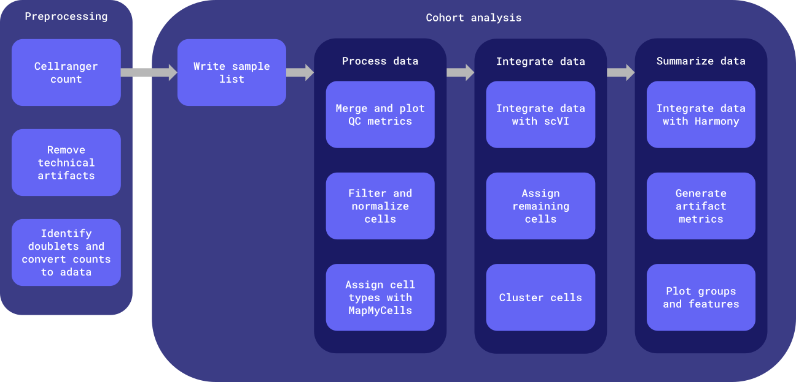

# PMDBS sc/sn RNAseq pipeline Python scripts with scVI

## _PREPROCESSING_
- _pre-preprocessing_: executed by WDL [`cellbender :: remove_technical_artifacts`](../../../workflows/preprocess/preprocess.wdl#L327-L350)

- _doublet detection_ + _qc metrics_: [`prep_metadata`](./main/prep_metadata)
    - Calculates `scrublet` metrics and adds additional metrics to metadata

- _merge and plot QC_: [`merge_and_plot_qc`](./main/merge_and_plot_qc)
    - Merges adatas
    - Plot general QC metrics for all cells
    - Save initial metadata

- _filtering_: [`filter`](./main/filter)
    - QC filtering

## _PROCESSING_

- _map my cells_: [`mmc`](./main/mmc)
    - Leverage Allen Brain Map"s [MapMyCells](https://portal.brain-map.org/atlases-and-data/bkp/mapmycells) on SEA-AD taxonomy
    - This needs to be done BEFORE feature selection so we can leverage as many genes as possible
        - FUTURE: In the future we can map to just a subset of the taxonomy for efficiency (e.g. `nodes_to_drop`, or constructing a simplified reference)

- _processing_: [`process`](./main/process)
    - Normalize + feature selection (i.e. identification of highly variable genes)
    - Add PCA (for `harmony` integration)

## _INTEGRATE DATA_

- _cell transcriptional phenotype_: [`transcriptional_phenotype`](./main/transcriptional_phenotype)
    - Assign "cell_type" to high-fidelity mappings (i.e. correlation >0.5 and bootstrap_probability>0.5), all else "unknown" to the high level labels
    - Annotate adata & export full cell types

- _integration_: [`integrate_scvi`](./main/integrate_scvi)
    - `scVI` integration to remove batch effects (minimize non-biological variability)

- _assign remaining cells_: [`label_scanvi`](./main/label_scvi)
    - `scANVI` leverage cell-type from MMC to assign the rest of the cells

- _UMAP clustering_: [`clustering_umap`](./main/clustering_umap)
    - Updated to do leiden at 4 resolutions - [0.05, 0.1, 0.2, 0.4]
        - FUTURE: We may choose `mde` (`clustering_mde`) over `umap`, as it is super fast and efficient on a GPU, and the embeddings are only useful for visualization so the choice is semi-arbitrary

- __DEPRECATED__  --- _annotation_: [`DEPRECATED_annotate_cells.py`](./main/DEPRECATED_annotate_cells.py)
    - Use cellassign and a list of marker genes. Currently using CARD cortical list of genes. NOTE: this is not annotating the "clusters" but the cells based on marker gene expression.

- _alternate integration_: [`add_harmony`](./main/add_harmony)
    - Add and Harmony integration obsm
    - Save final metadata

- _`SCIB` METRICS_: [`artifact_metrics`](./main/artifact_metrics)
    - Integration metrics
    - Compute `scib` metrics on final artifacts and generate a report to assess quality of batch correction vs. preservation of biological variability
    - TODO: make sure this works correctly. Current jax implementation fails.

## _PLOTTING_
- _plot groups and features_: [`plot_groups_and_feats`](./main/plot_groups_and_feats) 
    - Groups: "sample", "batch", "cell_type"
    - Features: "n_genes_by_counts", "total_counts", "pct_counts_mt", "pct_counts_rb", "doublet_score", "S_score", "G2M_score"
